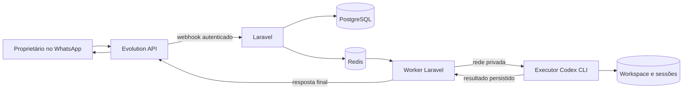

# Design

## Context

O diretório contém apenas OpenSpec e suas skills; não há aplicação, testes, infraestrutura ou specs existentes. Ver `proposal.md` para motivação. Decisões do proprietário: Laravel, Evolution API, Docker integral, VPS Azure, Codex com execução de comandos, login ChatGPT e conversa contínua com reset após 10 minutos sem novas mensagens.

O CLI disponível para inspeção é `0.160.1`. Sua ajuda confirma `exec`, `exec resume <SESSION_ID>`, entrada por stdin, eventos JSONL, captura da última resposta e `login --device-auth`. Não foi realizada execução autenticada. A documentação primária confirma esses mecanismos, mas a compatibilidade deve ser verificada na versão fixada no projeto.

## Goals / Non-Goals

**Goals:** separar recebimento, execução e entrega; persistir estado antes de confirmar entrada; serializar acesso ao workspace; isolar o executor das credenciais da ponte; permitir recuperação sem repetir efeitos do agente.

**Non-Goals:** disponibilidade distribuída, agente com controle da VPS, instalação livre de serviços no host, isolamento absoluto dos tokens ChatGPT contra comandos do próprio agente e entrega exatamente uma vez através do WhatsApp. O reset de conversa não limpa arquivos nem desfaz comandos.

## Decisions

### 1. Laravel como orquestrador e executor separado

Docker Compose terá serviços `app`, `worker`, `scheduler`, `codex-runner`, `evolution`, `postgres` e `redis`. App, worker e scheduler usam a mesma aplicação Laravel. PostgreSQL mantém bancos/usuários separados para Laravel e Evolution; Redis mantém fila Laravel e cache Evolution separados por configuração. O runner é um serviço HTTP mínimo em PHP com supervisor de processos, instalado com Codex CLI, Git e ferramentas básicas, sem banco ou Redis da aplicação.

Alternativas: executar Codex no worker simplifica a integração, mas expõe credenciais Evolution/banco aos comandos; montar socket Docker permite criar containers dinamicamente, mas dá acesso ao host. Um runner fixo evita ambas as situações. O MVP aceita uma execução global por vez.

### 2. Contrato interno do runner e contenção

`POST /runs` recebe ID de execução gerado pela aplicação, prompt e ID opcional de sessão; persiste a solicitação antes de retornar `202`. O mesmo ID/conteúdo retorna o estado já existente, nunca executa duas vezes; conteúdo divergente retorna conflito. `GET /runs/{id}` retorna estado, ID de sessão, resposta final ou erro classificado. Um supervisor único reivindica solicitações pendentes e executa sequencialmente. Estado/resultados ficam em volume próprio com escrita atômica; após reinício, registros iniciados sem resultado são `uncertain` e não reiniciam comandos. O worker consulta o resultado com timeout e não mantém a requisição HTTP aberta durante o prompt.

Runner e worker compartilham somente uma rede de execução. Runner não participa da rede de dados/Evolution; a rede permite saída para os serviços OpenAI. API interna exige token dedicado, limita tamanho de entrada e não aceita opções CLI, comandos administrativos ou caminhos arbitrários. O runner não tem portas publicadas. O token não é credencial de banco/Evolution e não deve entrar no ambiente do subprocesso.

Executar como usuário não root, sem capabilities extras, sem privilégio e sem socket Docker. Aplicar limites de CPU, memória e PIDs; filesystem da imagem somente leitura quando compatível, `/tmp` temporário e volumes explicitamente necessários. Configurar `workspace-write` e aprovação `never` via configuração fixa, também na retomada; ações fora do sandbox falham em vez de aguardar interação. Verificar suporte do sandbox no container durante o smoke test, sem introduzir bypass automático. Acesso de rede por ferramentas do agente permanece desabilitado no MVP; comunicação do CLI com OpenAI deve funcionar.

### 3. Adaptador Evolution e autorização

Configurar uma instância Evolution com conexão WhatsApp por QR Code e evento `MESSAGES_UPSERT`. Webhook aponta para a rede Docker e usa segredo em header configurado na versão escolhida; se a versão não suportar esse header, usar segredo no caminho da rota, sem registrar URLs completas. Validar a credencial antes de ler/processar o payload.

Normalizar número autorizado em formato internacional com somente dígitos, sem adivinhar DDD/país. Aceitar JID privado comprovadamente associado ao número; identidades LID exigem mapeamento confiável da Evolution, caso contrário são ignoradas. Ignorar `fromMe`, grupos, broadcasts, eventos de status e conteúdo sem texto. Extrair `conversation` e `extendedTextMessage.text`; anexos e legendas não são prompts no MVP. Usar instância e ID externo como chave única. Não confiar em nome de exibição ou número enviado em campo arbitrário.

Adaptador utiliza URL configurada e API key para envio textual; nunca utiliza a URL fornecida pelo webhook. Fixar versão da Evolution e contratos reais de webhook, autenticação e envio em fixtures. A documentação pública consultada confirma o evento, mas inclui material antigo; endpoints e campos exatos serão confirmados contra a versão fixada antes da integração. Alternativa de aceitar qualquer mensagem e filtrar no worker foi descartada porque criaria estado e atividade não autorizados.

### 4. Persistência, ordenação e janela de conversa

Tabelas propostas:

| Entidade | Dados e restrições |
| --- | --- |
| `conversation_heads` | Chave única instância/número; conversa atual e último recebimento aceito; linha usada para bloqueio transacional |
| `conversations` | Geração local, instância, número, ID Codex opcional, status, início e último recebimento |
| `inbound_messages` | ID externo único por instância, texto, `accepted_at` UTC, ordem monotônica, conversa e status |
| `executions` | Mensagem única, ID runner único, estado, início/fim, erro e resposta final |
| `outbound_parts` | Execução, índice único, texto, estado, ID Evolution e tentativas |

Na transação do webhook: bloquear a cabeça da conversa, verificar duplicata, calcular o intervalo de entrada, criar geração se não existir ou se o intervalo for `>= 600s`, associar mensagem e atualizar atividade. Hora é atribuída sob o bloqueio para preservar ordem concorrente. Duplicatas não atualizam atividade. A resposta HTTP ocorre apenas após commit.

O scheduler despacha mensagens pendentes persistidas para Redis; despacho imediato após commit reduz latência, e varredura periódica cobre crash entre commit e enqueue. Jobs verificam estado e reivindicam a mensagem atomicamente. Um lock global do workspace com lease renovável e duração superior ao timeout impede concorrência; o runner também só executa uma solicitação por vez. Nunca iniciar execução posterior enquanto a anterior estiver sem estado terminal confirmado.

O reset é lógico: na primeira entrada após o prazo cria-se uma geração sem ID Codex. Nenhum processo é morto por expiração e não é necessário um timer para limpar histórico. Mensagens antigas na fila conservam sua geração; respostas tardias só atualizam essa geração, sem substituir a cabeça atual. Execuções e envios seguem a ordem local de aceitação, não timestamps enviados pelo cliente. IDs de sessão e arquivos sobrevivem a reinícios; não usar `--last` ou `--ephemeral`.

Alternativa de medir inatividade no início do job foi descartada porque atrasos da fila causariam reset incorreto. Repetições e respostas do bot não renovam a janela.

### 5. CLI, instruções e autenticação

O runner inicia processos por vetor de argumentos e stdin, com diretório de trabalho fixo `/workspace`, nunca por shell interpolado. Execução nova usa `codex exec --json --output-last-message <arquivo-único> -`; continuação usa `codex exec resume --json --output-last-message <arquivo-único> <SESSION_ID> -`. Flags e sandbox são fixos e verificados na versão empacotada. Usar repositório Git inicializado no workspace. Parsear JSONL para capturar ID de thread e estado terminal; publicar o arquivo da resposta final apenas com exit code de sucesso e conclusão reconhecida. stderr e eventos de ferramentas ficam fora do WhatsApp.

Versionar `agent/AGENTS.md`, montado somente para leitura em `/workspace/AGENTS.md`; conteúdo inicial em português, instruções de execução no workspace, preservação de segredos e respostas úteis para WhatsApp. Não criar instruções globais conflitantes. Validar presença/conteúdo antes de cada run. A configuração do CLI é fixa e versionada, montada somente para leitura separadamente das credenciais. Confirmar por smoke test que instruções entram em execução nova e retomada.

Autenticação manual com `codex login --device-auth` executada dentro do runner, como o mesmo usuário do serviço, com volume persistente de estado Codex. Documentar ativação do método na conta/workspace e alternativa oficial por transferência segura do cache de login se necessário. Não ler nem publicar tokens. Verificar `codex login status` no diagnóstico; falta de login, expiração e limites da conta geram falha curta. Não injetar `OPENAI_API_KEY` e não mudar automaticamente para faturamento por API.

Alternativa de usar API de modelos diretamente foi descartada porque não atende ao requisito de CLI e login ChatGPT.

### 6. Falhas, entrega e recuperação

Timeout inicial de execução: 300 segundos, configurável e independente da janela de conversa. Supervisor cria grupo de processos e encerra todos os descendentes com escalada TERM/KILL; limites de memória/PIDs dão uma segunda barreira. Entrada terá limite configurável inicialmente de 16 KiB. Mensagem excedente recebe aviso sem iniciar run nem renovar atividade. Respostas são persistidas e divididas por caracteres Unicode, inicialmente em partes de até 3.000 caracteres, preferindo quebras de linha. Esses limites são escolhas do produto e serão exercitados contra a Evolution fixada.

Estado de execução: `pending`, `running`, `succeeded`, `failed`, `uncertain`. O ID estável permite reconciliar perda da resposta HTTP sem repetir a execução. Crash do runner após iniciar comandos, sessão inválida ou resultado irrecuperável invalida o ID da conversa afetada; avisar que a próxima mensagem começará sem o contexto anterior. Mensagens já enfileiradas nessa geração passam a construir a nova sessão em ordem, após o aviso. Timeout não implica rollback de arquivos.

Uma falha definida de entrega permite retries limitados com backoff; resposta permanece armazenada e nunca reexecuta o Codex. Timeout após iniciar envio ou crash entre aceitação externa e commit local produz `uncertain`; parar entregas seguintes até reconciliação pelo operador, evitando reordenação. Fornecer comandos Artisan para listar entregas incertas e marcar enviada ou reenviar explicitamente. Aceitação pela Evolution não equivale a confirmação de leitura/entrega no aparelho. Não alegar exatamente uma vez.

### 7. Configuração e operação Azure

Versionar `.env.example` sem valores reais: número autorizado, instância, URL/chave Evolution, segredo webhook, token runner, timeout, limites de mensagens, credenciais PostgreSQL/Redis e `APP_KEY`. Usar tags/digests fixados e dependências travadas, sem `latest`. Escolher versões estáveis suportadas de Laravel/PHP e compatíveis com a Evolution durante bootstrap; o requisito não impõe uma major.

Webhook é interno; não há necessidade de domínio público no MVP. Administração e pareamento Evolution via túnel SSH, com binding opcional em localhost. Runbook para VM Linux Azure: instalar Docker/Compose, criar diretórios e permissões de volumes, configurar NSG/firewall com SSH restrito, subir stack, migrar, autenticar Codex, parear WhatsApp, registrar/verificar webhook e testar número permitido e rejeitado. Se futuramente houver endpoint público, exigir reverse proxy com HTTPS antes de expô-lo.

Healthchecks separados: Laravel, banco, Redis, runner, login Codex e conexão Evolution. Logs estruturados com IDs e erros classificados, sem prompt/resposta completos por padrão. Texto persistido no banco e histórico Codex exigem backup protegido. Backups incluem banco, workspace e sessões Evolution/Codex; parada controlada dos serviços antes do snapshot mantém consistência. Documentar restauração, rotação de credenciais e preservação de volumes.

## Risks / Trade-offs

- [Comandos podem alterar arquivos e causar efeitos] → workspace dedicado, sandbox, serialização e nenhuma repetição automática de runs incertos; o timeout não desfaz operações.
- [Agente pode acessar credenciais ChatGPT necessárias ao próprio CLI] → runner separado, tokens fora do código/imagem e acesso operacional restrito; o container não elimina esse risco interno.
- [Sessões e uso dependem da conta ChatGPT] → diagnóstico, falhas claras e procedimento de relogin; não assumir disponibilidade ilimitada.
- [Payloads Evolution e identidade LID variam por versão] → fixtures reais, tags fixadas e autorização conservadora.
- [Falha entre envio externo e persistência] → entrega incerta e reconciliação explícita; não existe garantia de exatamente uma vez.
- [VPS única é ponto de falha e volumes crescem] → backups, limites, monitoramento de disco e atualização controlada; sem HA neste MVP.

## Migration Plan

Sem migração de sistema anterior. Implementar e validar localmente com serviços Docker e adaptadores falsos; depois executar smoke autenticado com conta e número reais fornecidos pelo operador. Provisionar a VPS manualmente pelo runbook, configurar segredos, migrar banco e testar ponta a ponta antes de operação contínua.

Para atualização: pausar ingresso e drenar/parar execução, realizar backup consistente, aplicar imagem fixada e migrações compatíveis, retomar serviços e verificar saúde/login/webhook. Para rollback: voltar à imagem anterior quando o schema for compatível; caso contrário restaurar backup com o serviço parado. Runs e entregas em andamento devem ser reconciliados antes de liberar novos prompts. Nunca remover volumes como parte de um restart normal.

## Open Questions

Valores operacionais a fornecer na implantação: número em formato internacional, conta ChatGPT com acesso ao Codex, conta WhatsApp para pareamento, IP/usuário SSH e tamanho da VPS. Não alteram os contratos ou a arquitetura; recursos serão ajustados após o smoke test.

## References

- [Codex não interativo](https://learn.chatgpt.com/docs/non-interactive-mode): execução, saída final, JSONL e retomada por ID.
- [Autenticação Codex](https://learn.chatgpt.com/docs/auth): login ChatGPT e autenticação de dispositivo em ambiente headless.
- [Instruções AGENTS.md](https://learn.chatgpt.com/docs/agent-configuration/agents-md): descoberta por diretório e configuração de nomes alternativos.
- [Webhooks Evolution](https://github.com/evolution-foundation/evolution-docs/blob/main/docs/02-Configuration/Webhooks.md): eventos de entrada; contrato exato deverá corresponder à versão fixada.
- [Compose Evolution](https://github.com/evolution-foundation/evolution-api/blob/main/docker-compose.yaml) e [rotas de envio](https://github.com/evolution-foundation/evolution-api/blob/main/src/api/routes/sendMessage.router.ts): fontes primárias para validar dependências e integração.
